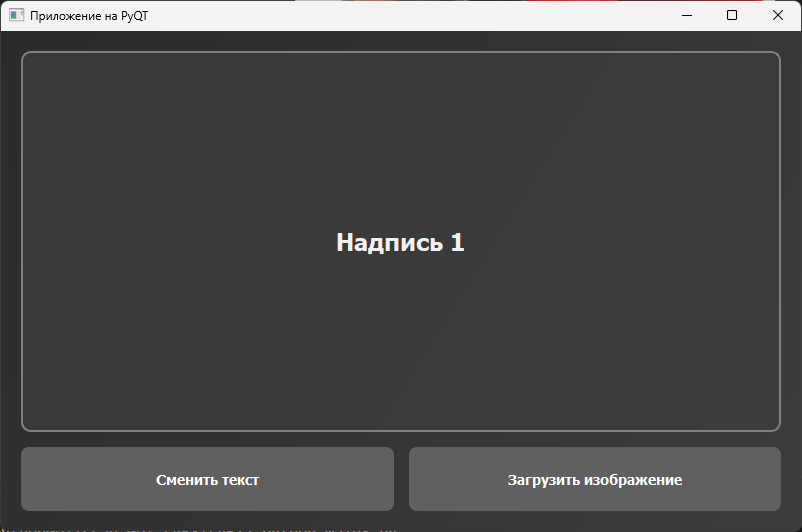
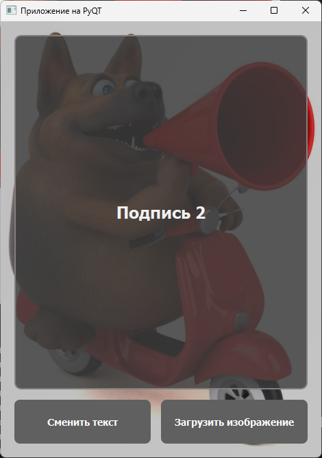

# Приложение на PyQT

### Выполнил
Иванов Артем 6233-010402D

- PyQT5
- Две кнопки: "Изменить текст" и "Загрузить изображение"

## Скриншоты работы программы

1. **Скриншот 1**  
   

3. **Скриншот 2**  
   

3. **Скриншот 3**  
   

3. **Скриншот 4**  
   
