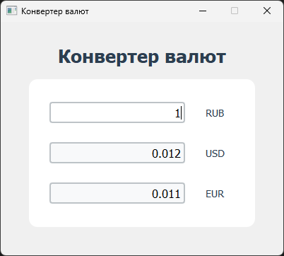
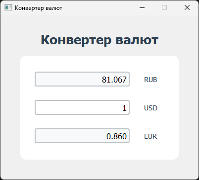
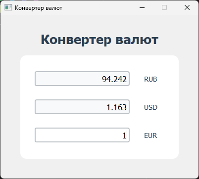

# Конвертер валют

### Выполнил
Иванов Артем 6233-010402D

- Три вида валют: доллары (USD), евро (EUR), рубли (RUB)
- Автоматическая конвертация при вводе в поле
- Используемое [API](https://exchangerate-api.com/) `https://v6.exchangerate-api.com/v6/`{api_key}`/latest/USD`

## Скриншоты работы программы

1. **Скриншот 1**  
   

3. **Скриншот 2**  
   

3. **Скриншот 3**  
   
