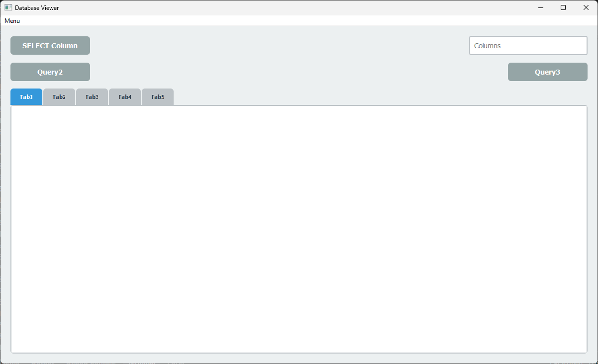
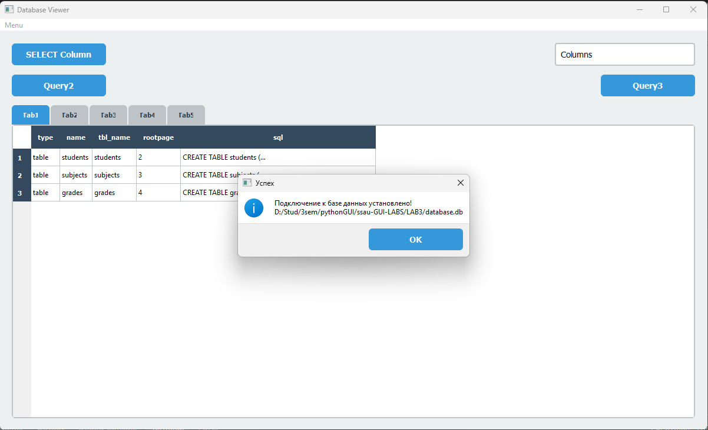
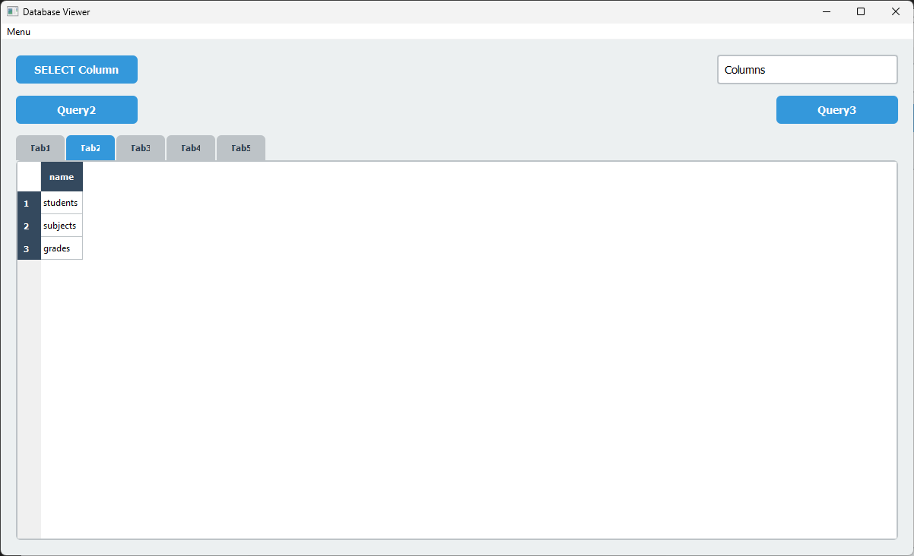
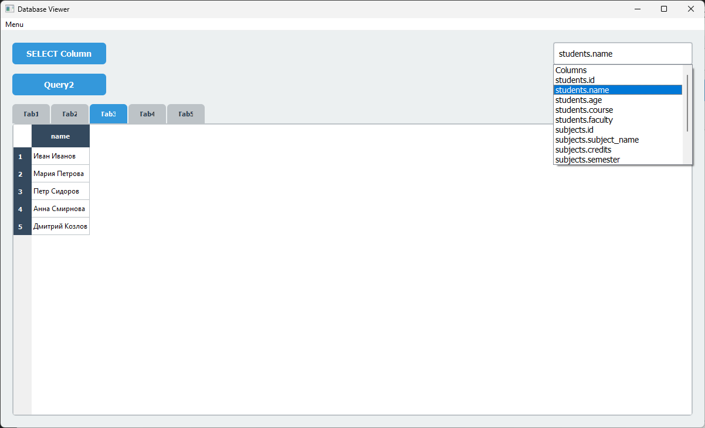
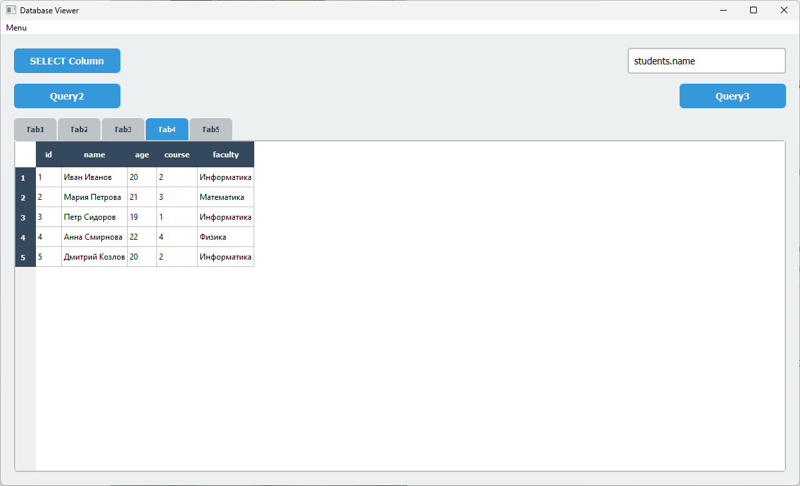
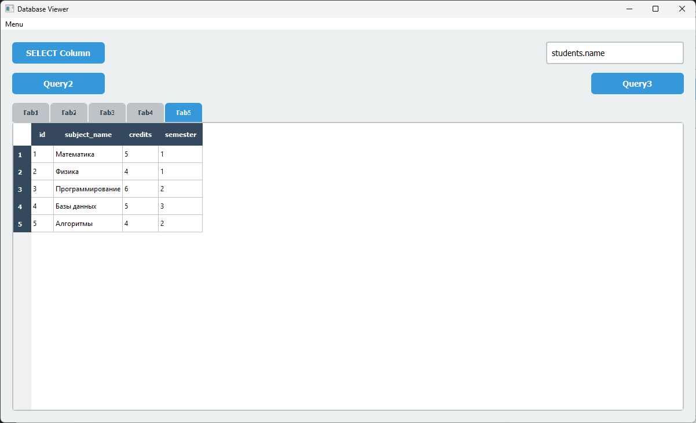
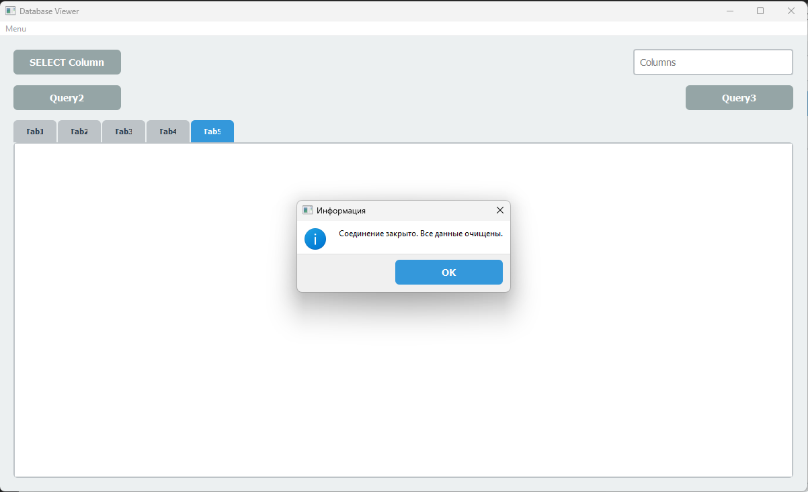
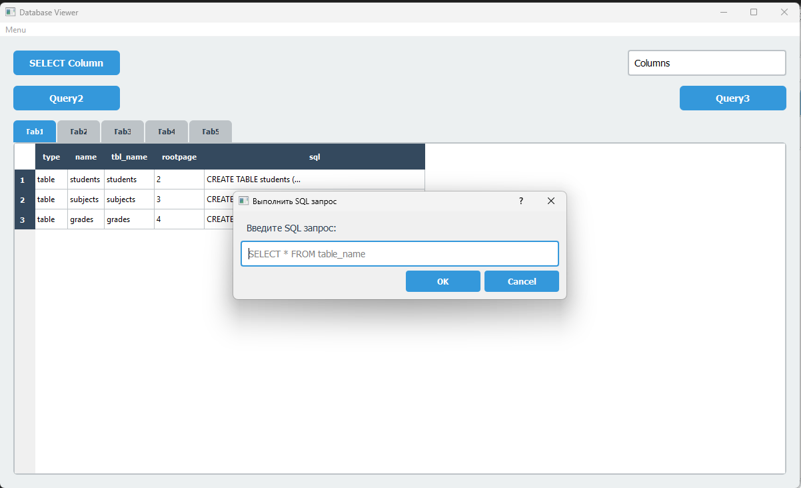

# Приложение на PyQt5 для работы с SQLite базами данных

### Выполнил
Иванов Артем 6233-010402D

- Подключение/отключение к SQLite базам данных
- Просмотр структуры базы данных
- Выполнение SQL запросов (при помощи интерфейса + при помощи SQL запросов)
- Отображение результатов в табличном виде

##

Скрипт `create_db.py` создаст файл `database.db` с тремя таблицами:
- **students** - информация о студентах
- **subjects** - информация о предметах
- **grades** - оценки студентов

## Скриншоты работы программы

1. **Скриншот 1**  
   

2. **Скриншот 2**  
   

3. **Скриншот 3**  
   

4. **Скриншот 4**  
   

5. **Скриншот 5**  
   

6. **Скриншот 6**  
   

7. **Скриншот 7**  
   

8. **Скриншот 8**  
   

